# PawMed
A project in the course "Databases Systems and Applications" in 6th semester of computer science.

## Specification
<div align="center">
<a href="docs/reports/specification.pdf">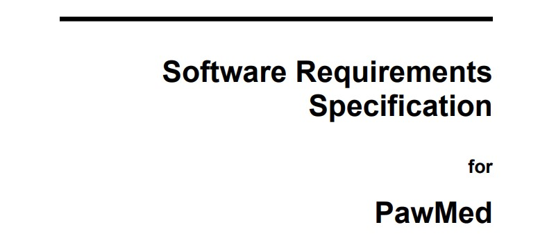</a>
<p>Application Specification (<a href="docs/readme/specification.pdf">click to view</a>).</p>
</div>

## Sample Screenshots
<div align="center">
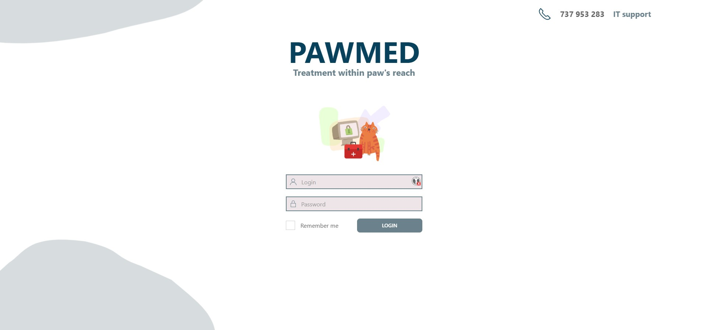
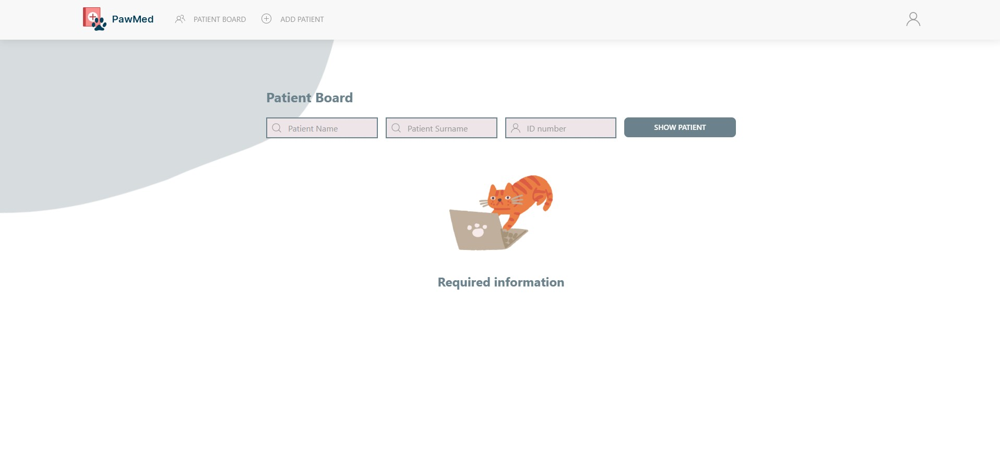
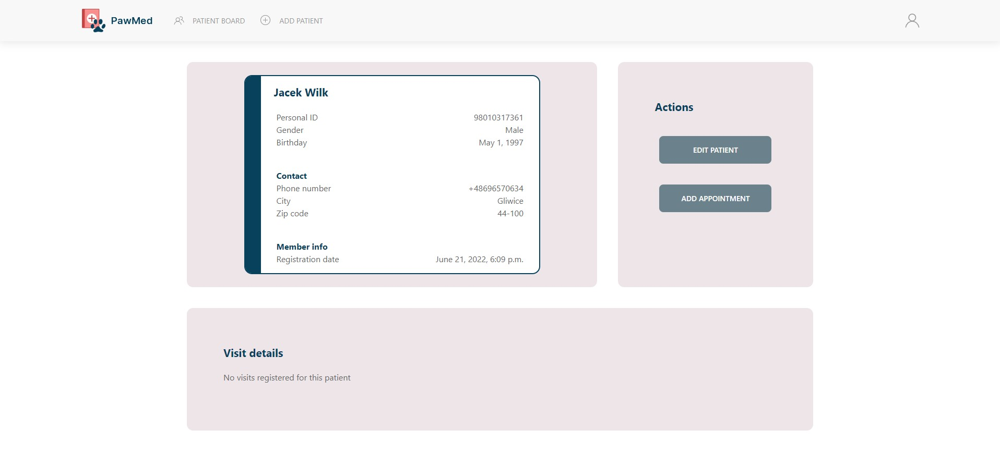

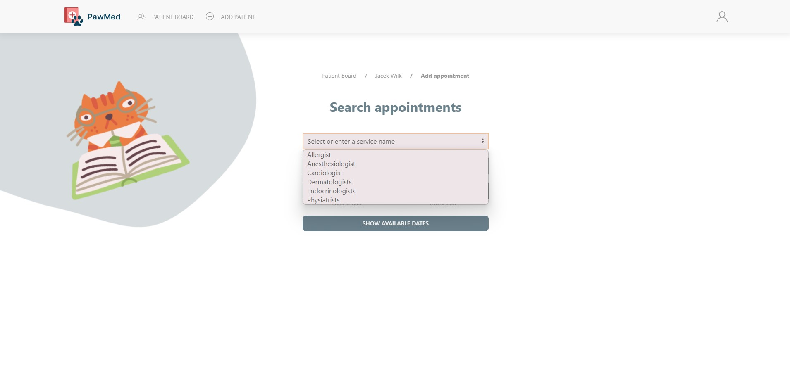
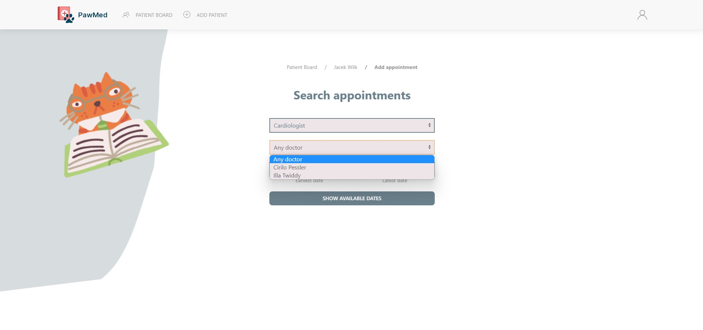
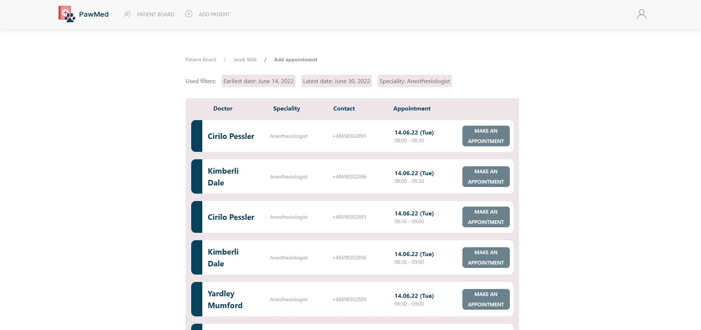
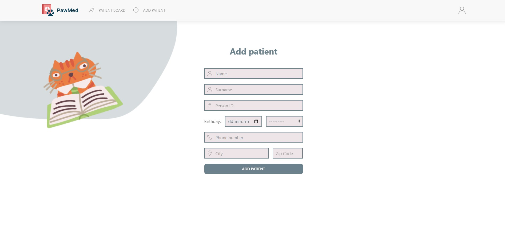
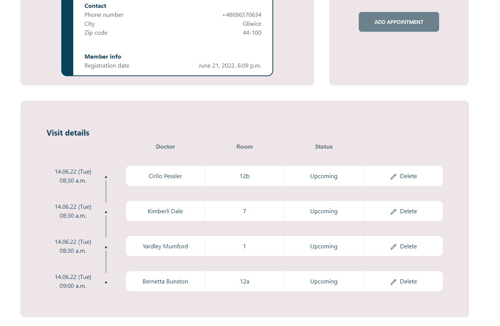
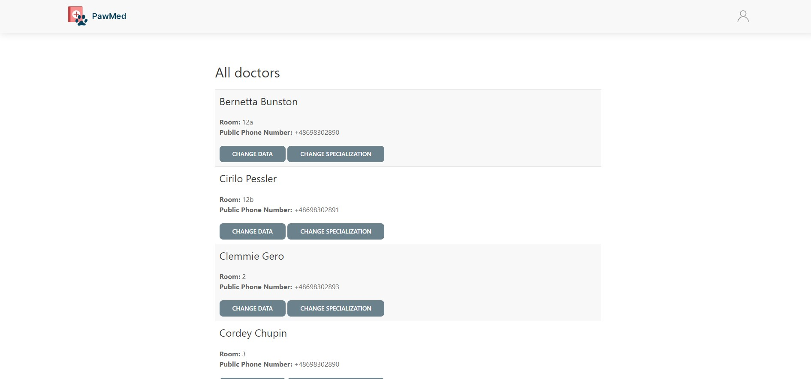
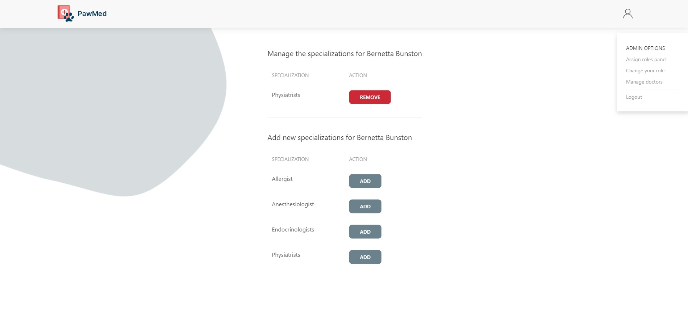
</div>

## Instruction
### Docker
Instruction for running PostgreSql database with Django:
1. Install Docker and optionally Docker Desktop
2. Install latest PostgreSql official image with: 
```
docker pull postgres
```
3. Run database image with Docker Desktop or using
```
docker run --name pawmed -e POSTGRES_PASSWORD=password -d -p 5432:5432 postgres:latest 
```
### Non Docker
4. Configure the database by running one of the two scripts
```
pawmedEnv/databaseConfigurator.bat
```
```
pawmedEnv/databaseConfigurator.sh
```
5. Connect to database using preferred admin tool
6. Run model creation script from PawMed/db-scripts/data_model1_table_create.sql
